# 1. 安装 seo_checklist 模块

安装并启用 *seo_checklist* 模块。

```bash
cd /var/www/html/
composer require drupal/seo_checklist
vendor/drush/drush/drush -y en seo_checklist
```

# 2. 访问并配置模块

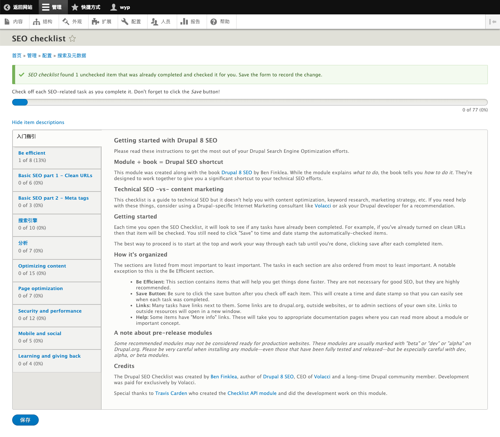

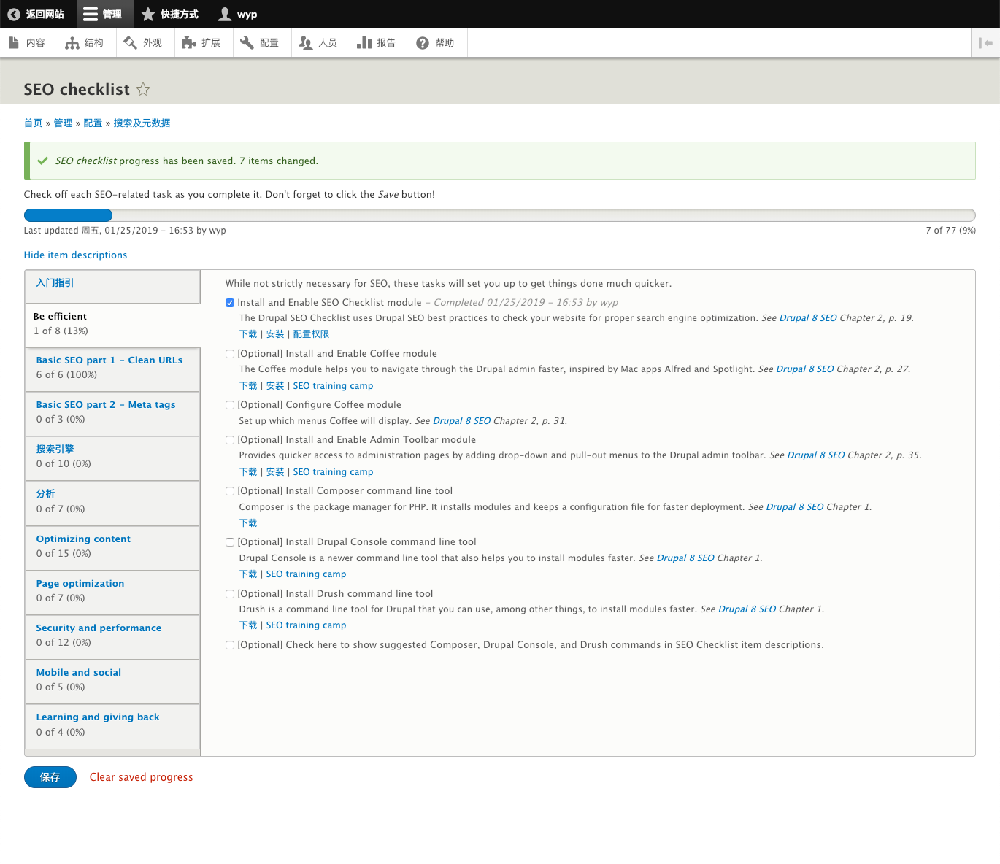

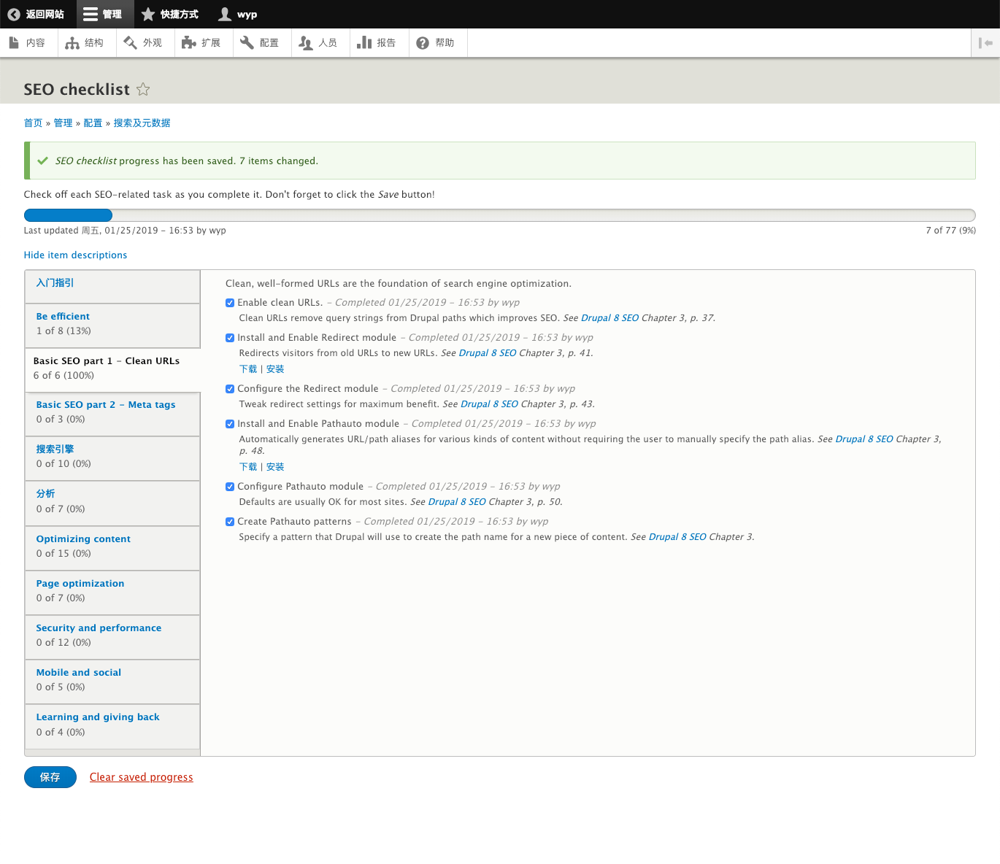

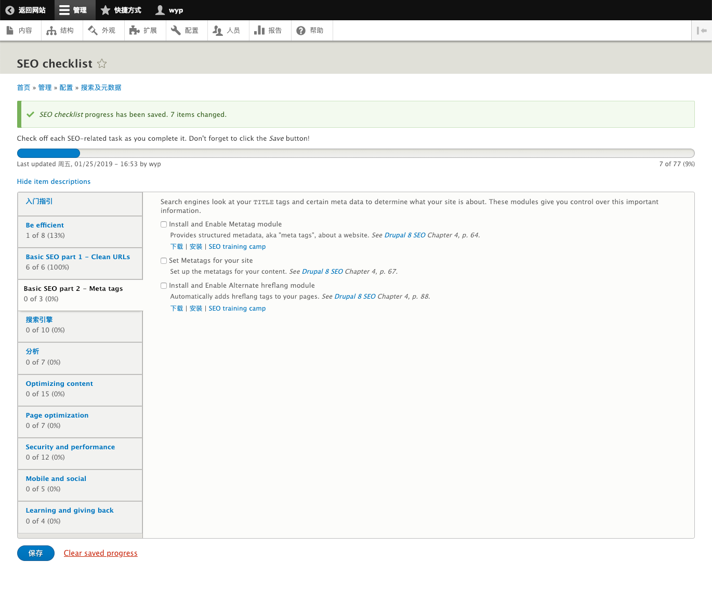

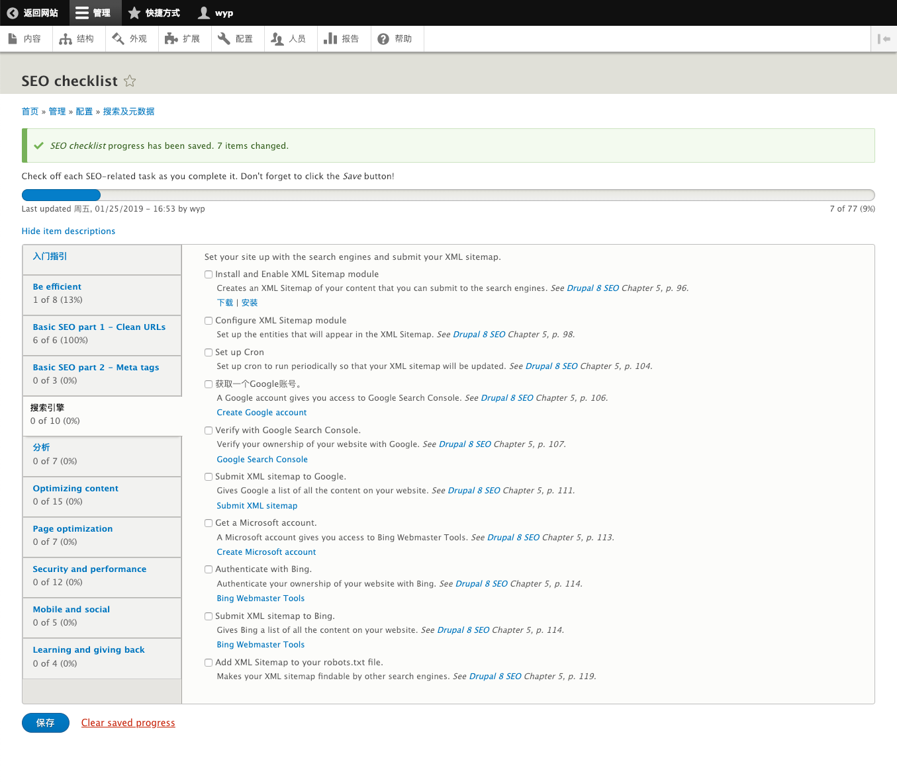

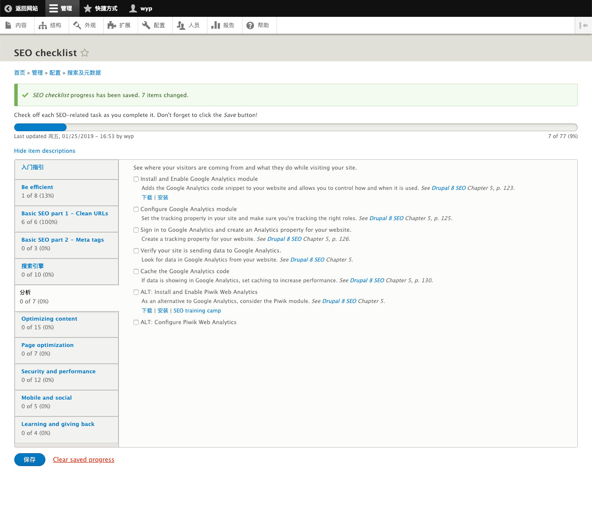

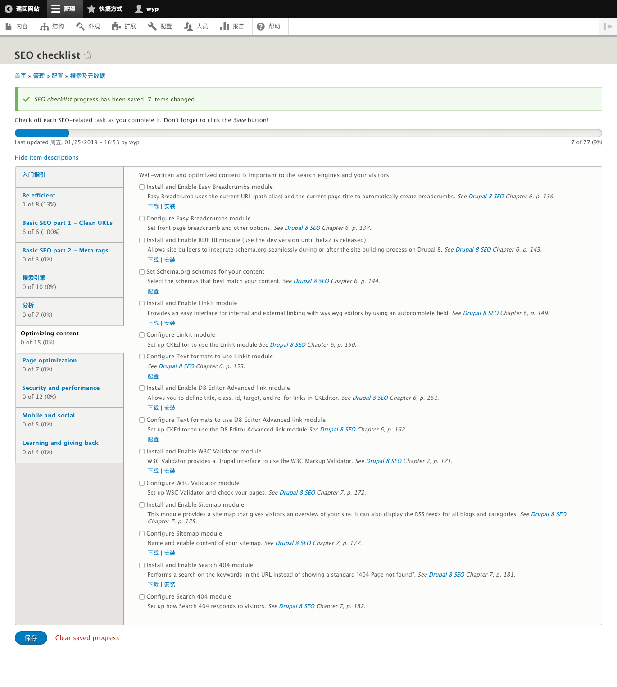

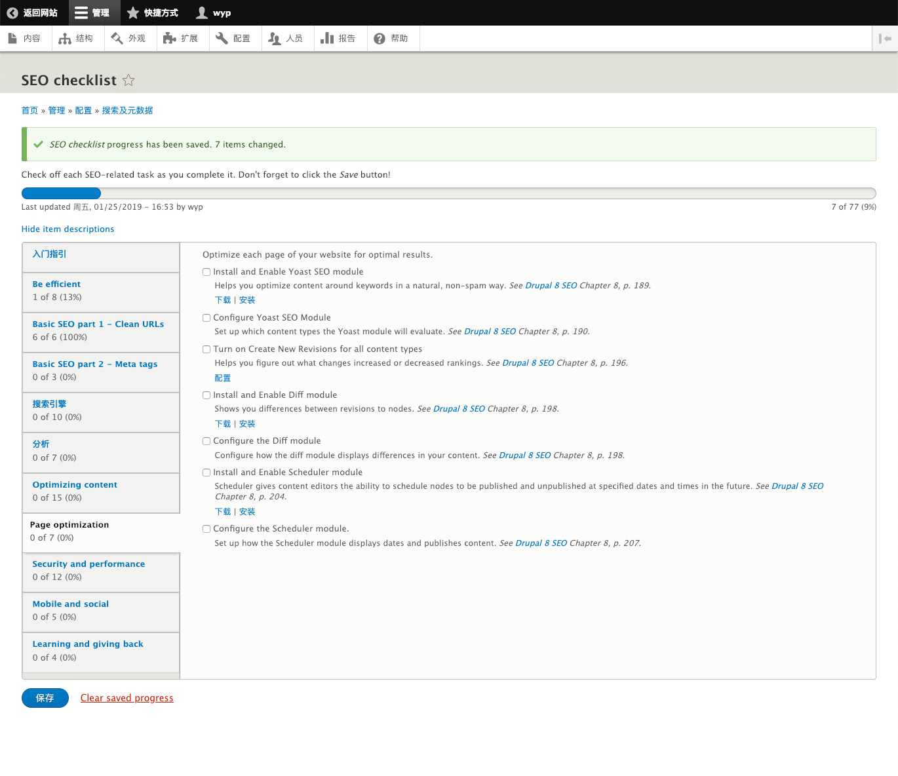

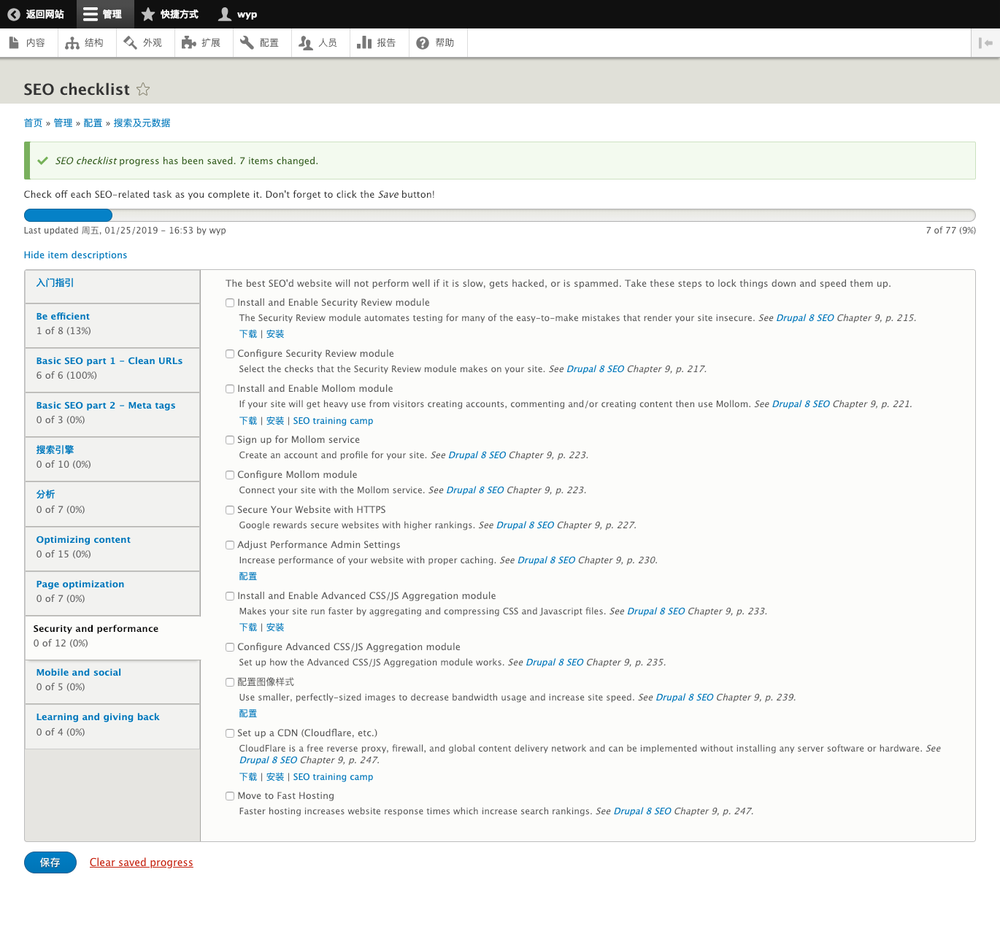

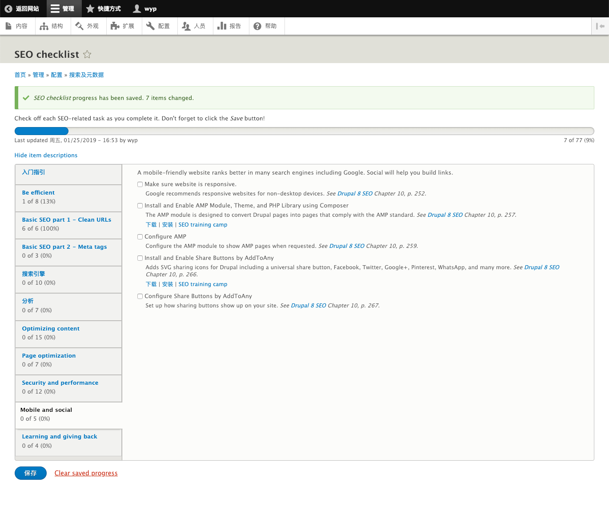

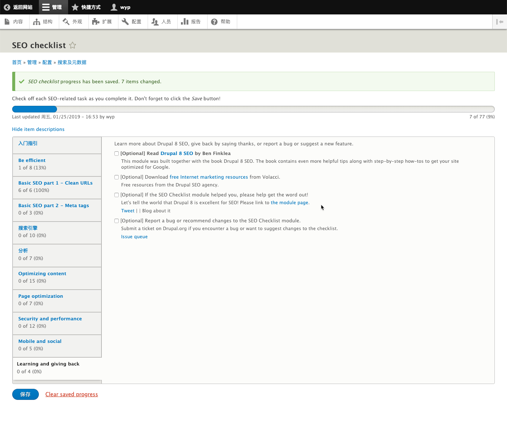
