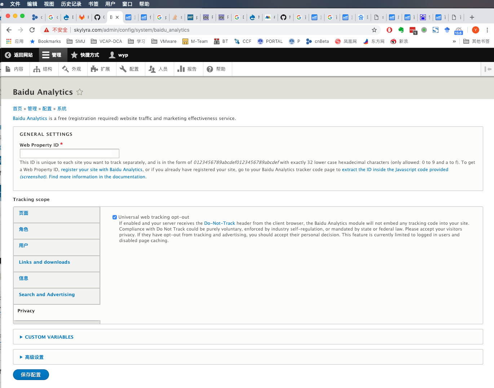

# 1. 在百度统计中注册站点

访问 https://tongji.baidu.com ，注册站点。

注册站点后，获取统计代码

```javascript
<script>
var _hmt = _hmt || [];
(function() {
  var hm = document.createElement("script");
  hm.src = "https://hm.baidu.com/hm.js?XXXXXXXXXXXXXXXXXXXXXXXXXXXXXXXX";
  var s = document.getElementsByTagName("script")[0]; 
  s.parentNode.insertBefore(hm, s);
})();
</script>
```

复制其中的XXXXXXXX段。

# 2. 启用 baidu_analytics 模块

```bash
cd /var/www/html/web/modules/contrib
git clone --branch 8.x-1.x https://git.drupal.org/project/baidu_analytics.git
cd /var/www/html
./vendor/drush/drush/drush -y en baidu_analytics
```

# 3. 配置 百度统计 模块

在 *Web Property ID* 文本框中输入前面复制的代码，并点击 *保存配置* 。


