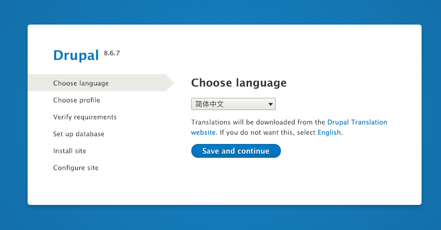
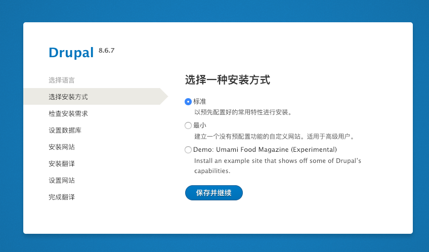
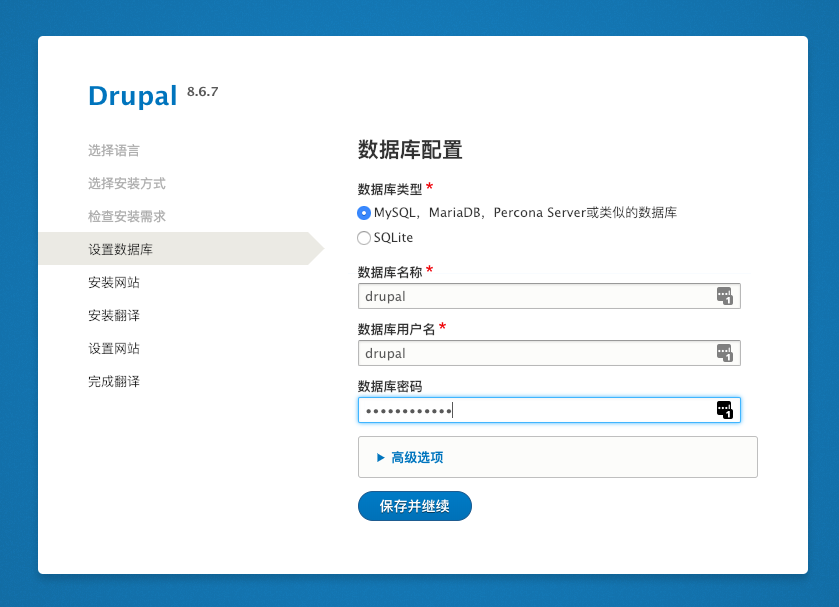
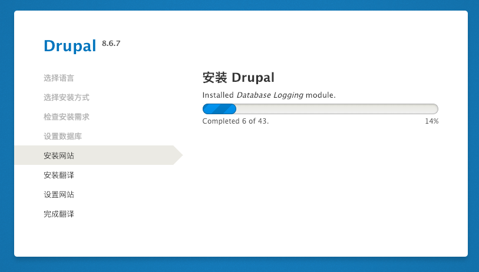
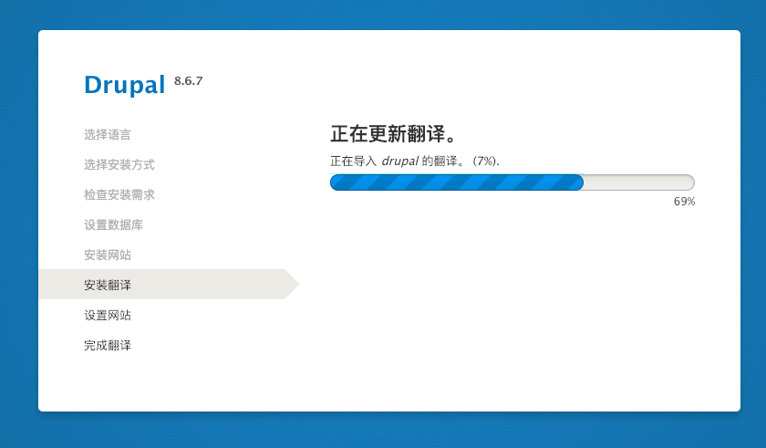
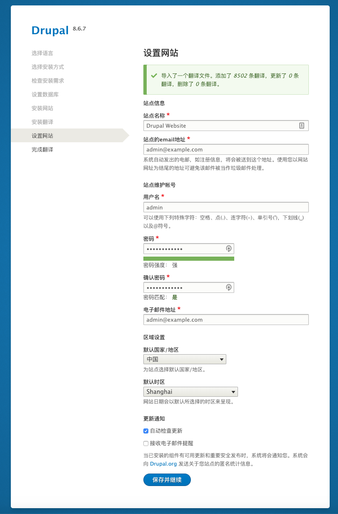
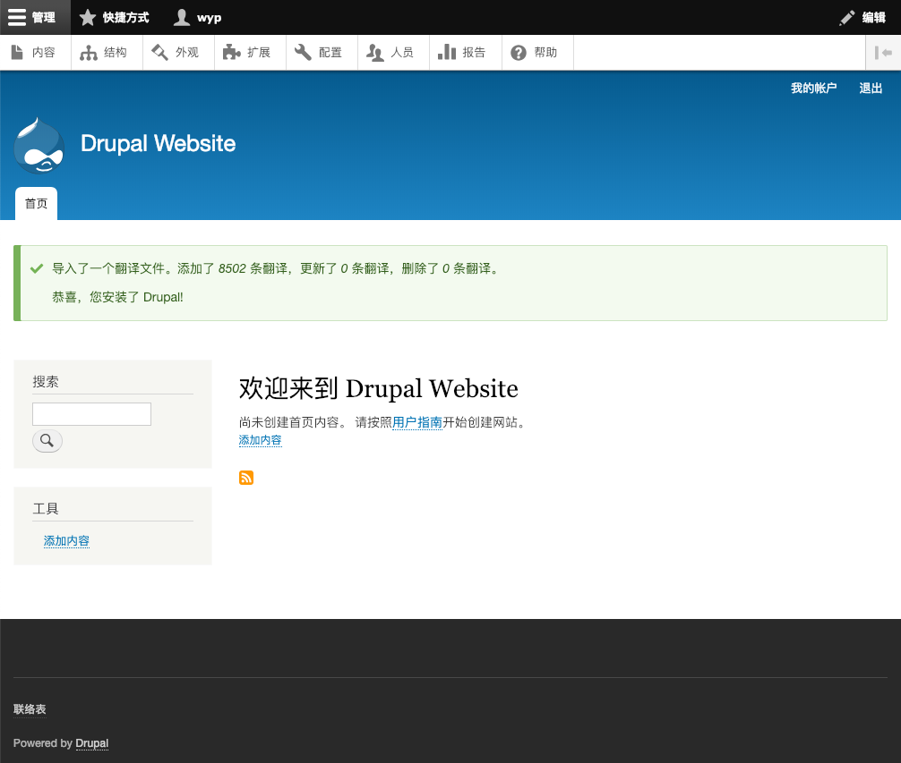

在浏览器中访问 *http://SERVER/* 进行后续安装。

# 选择安装语言

点击 *Save and continue* 继续安装

# 选择一种安装方式

选择 *标准* 

单击 *保存并继续* 继续安装

# 数据库配置

选择 *MySQL, MariaDB, Percona Server或类似的数据库* 

输入正确的*数据库名称*，*数据库用户名*，*数据库密码*。

单击*保存并继续*

# 安装 Drupal

# 正在更新翻译

# 设置站点

正确填写相关信息

单击*保存并继续*

# 完成安装

完成安装
